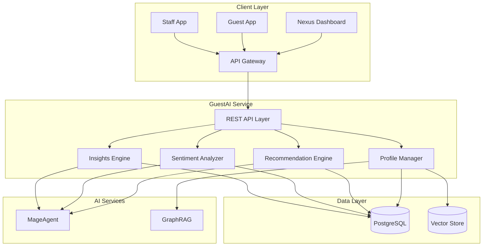
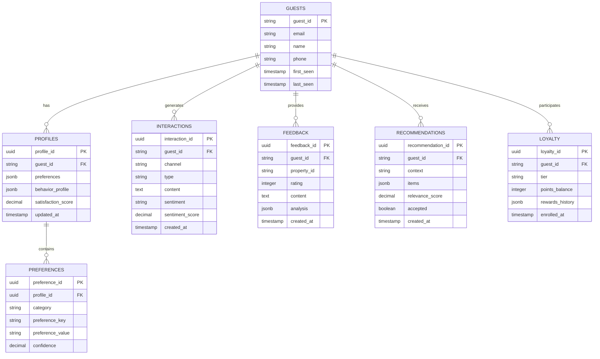
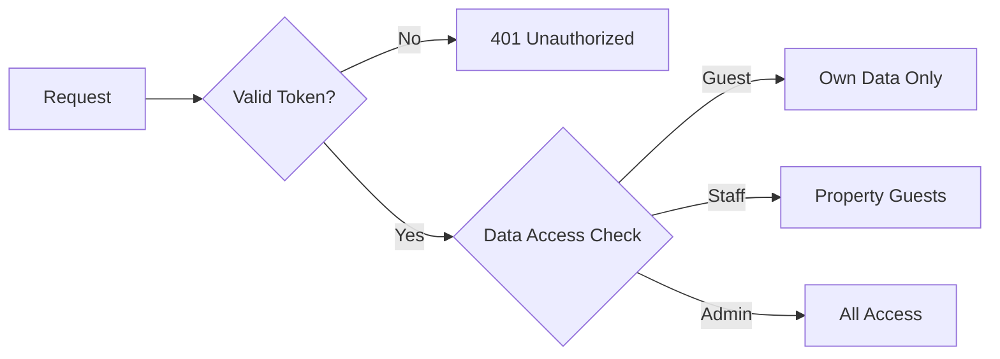

# GuestAI Architecture

Technical architecture and system design for the AI-powered guest experience platform.

---

## System Overview



---

## Core Components

### 1. REST API Layer

| Endpoint | Method | Description |
|----------|--------|-------------|
| `/api/v1/profile` | POST | Create/update guest profile |
| `/api/v1/recommendations/:guestId` | GET | Get personalized recommendations |
| `/api/v1/feedback/analyze` | POST | Analyze guest feedback |
| `/api/v1/insights` | GET | Get guest insights |

### 2. Profile Manager

Comprehensive guest profile management with preference learning.

**Capabilities:**
- Multi-source profile enrichment
- Preference inference from behavior
- Cross-property profile sync
- Privacy-compliant data handling

### 3. Recommendation Engine

AI-powered personalization engine.

**Features:**
- Context-aware recommendations
- Real-time personalization
- Multi-category suggestions
- A/B testing support

### 4. Sentiment Analyzer

Real-time sentiment analysis across all channels.

**Analysis Types:**
- Text sentiment (reviews, chat, email)
- Voice sentiment (call recordings)
- Behavioral sentiment (actions, patterns)

### 5. Insights Engine

Aggregated analytics and trend detection.

**Metrics:**
- NPS tracking
- Satisfaction trends
- Issue categorization
- Improvement recommendations

---

## Data Model



---

## Security Model

### Authentication
- Bearer token via Nexus API Gateway
- Guest app uses secure token exchange
- Staff authenticated via SSO

### Authorization
- Role-based: Guest, Staff, Manager, Admin
- Property-level data isolation
- GDPR-compliant data access

### Data Protection
- PII encryption at rest and in transit
- Right to deletion support
- Consent management
- Data retention policies



---

## Deployment Architecture

### Kubernetes Configuration

```yaml
apiVersion: apps/v1
kind: Deployment
metadata:
  name: nexus-guestexperience
  namespace: nexus-plugins
spec:
  replicas: 3
  selector:
    matchLabels:
      app: nexus-guestexperience
  template:
    spec:
      containers:
      - name: guest-api
        image: adverant/nexus-guestexperience:1.0.0
        ports:
        - containerPort: 8080
        resources:
          requests:
            memory: "1Gi"
            cpu: "500m"
          limits:
            memory: "2Gi"
            cpu: "1000m"
        livenessProbe:
          httpGet:
            path: /live
            port: 8080
        readinessProbe:
          httpGet:
            path: /ready
            port: 8080
```

### Resource Allocation

| Resource | Request | Limit |
|----------|---------|-------|
| CPU | 500m | 1000m |
| Memory | 1Gi | 2Gi |
| Disk | 3Gi | 5Gi |

---

## Integration Points

### MageAgent Integration

- **Sentiment Analysis**: Multi-modal understanding
- **Recommendation Generation**: Context-aware suggestions
- **Concierge Queries**: Natural language understanding

### GraphRAG Integration

- **Guest Knowledge**: Store and retrieve guest context
- **Property Knowledge**: Local recommendations
- **Preference Learning**: Pattern recognition

### Event Bus

| Event | Payload | Subscribers |
|-------|---------|-------------|
| `guest.profile.updated` | Profile changes | Recommendations, Analytics |
| `guest.feedback.received` | Feedback data | Sentiment, Insights |
| `guest.sentiment.negative` | Alert data | Service Recovery |

---

## Performance

### Rate Limits

| Tier | Requests/min | Guests/mo |
|------|--------------|-----------|
| Starter | 60 | 1,000 |
| Professional | 300 | 10,000 |
| Enterprise | Custom | Unlimited |

### Caching

- Guest profiles: 15 minute TTL
- Recommendations: 1 hour TTL (invalidated on profile update)
- Insights: 6 hour TTL

### Latency Targets

| Operation | Target | P99 |
|-----------|--------|-----|
| Profile Lookup | 50ms | 150ms |
| Recommendations | 200ms | 500ms |
| Sentiment Analysis | 100ms | 300ms |

---

## Monitoring

### Metrics (Prometheus)

```
# Guest metrics
guest_profiles_total
guest_interactions_total{channel, sentiment}
guest_satisfaction_score{property_id}

# Recommendation metrics
guest_recommendations_generated{category}
guest_recommendations_accepted{category}

# Sentiment metrics
guest_sentiment_scores{channel}
guest_service_recovery_triggered
```

### Alerting

| Alert | Condition | Severity |
|-------|-----------|----------|
| Negative Sentiment Spike | >20% negative in 1 hour | Warning |
| NPS Drop | >5 point drop | Warning |
| Service Recovery Backlog | >10 unresolved | Critical |

---

## Next Steps

- [Quick Start Guide](./QUICKSTART.md) - Get started quickly
- [Use Cases](./USE-CASES.md) - Implementation scenarios
- [API Reference](./docs/api-reference/endpoints.md) - Complete docs
