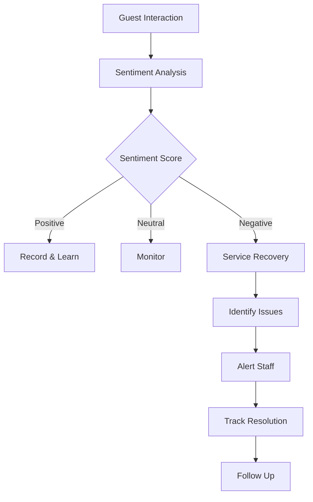

# GuestAI Use Cases

Real-world implementation scenarios for AI-powered guest experience management.

---

## Use Case 1: Personalized Pre-Arrival Experience

### Problem

Guests receive generic welcome emails with no personalization. Opportunities to upsell and delight are missed.

### Solution

AI-generated personalized pre-arrival communications with tailored recommendations.

### Implementation

```typescript
import { NexusClient } from '@adverant/nexus-sdk';

class PreArrivalService {
  private guest;

  constructor(nexusClient: NexusClient) {
    this.guest = nexusClient.plugin('nexus-guestexperience');
  }

  async sendPreArrivalExperience(bookingId: string) {
    const booking = await this.getBooking(bookingId);

    // Get or create guest profile
    const profile = await this.guest.profile.getOrCreate({
      email: booking.guestEmail,
      name: booking.guestName
    });

    // Enrich profile with booking history
    await this.guest.profile.enrich({
      guestId: profile.guestId,
      bookingHistory: await this.getBookingHistory(booking.guestEmail)
    });

    // Generate personalized recommendations
    const recommendations = await this.guest.recommendations.generate({
      guestId: profile.guestId,
      context: 'pre_arrival',
      propertyId: booking.propertyId,
      stayDates: { checkIn: booking.checkIn, checkOut: booking.checkOut },
      categories: ['dining', 'activities', 'upgrades', 'amenities']
    });

    // Generate personalized email content
    const emailContent = await this.guest.communications.generate({
      guestId: profile.guestId,
      template: 'pre_arrival',
      personalizations: {
        recommendations: recommendations.top5,
        specialOffers: recommendations.upgrades,
        localEvents: recommendations.events
      }
    });

    return {
      emailContent,
      recommendations,
      sentAt: new Date()
    };
  }
}
```

### Business Impact

- **35% higher** upsell conversion
- **4.6 average** pre-arrival email rating
- **25% increase** in add-on revenue

---

## Use Case 2: Real-Time Sentiment Monitoring

### Problem

Negative guest experiences go undetected until post-stay reviews. By then, it's too late for service recovery.

### Solution

Real-time sentiment analysis across all guest touchpoints for proactive intervention.

### Implementation

```typescript
class SentimentMonitoringService {
  private guest;

  constructor(nexusClient: NexusClient) {
    this.guest = nexusClient.plugin('nexus-guestexperience');
  }

  async analyzeGuestInteraction(interaction: GuestInteraction) {
    // Analyze sentiment in real-time
    const analysis = await this.guest.sentiment.analyze({
      guestId: interaction.guestId,
      content: interaction.content,
      channel: interaction.channel, // chat, email, phone, in_person
      context: interaction.context
    });

    // Check for service recovery trigger
    if (analysis.sentiment === 'negative' || analysis.score < 5) {
      // Create service recovery case
      const recovery = await this.guest.serviceRecovery.create({
        guestId: interaction.guestId,
        triggerInteraction: interaction.id,
        sentimentScore: analysis.score,
        issues: analysis.detectedIssues,
        urgency: this.calculateUrgency(analysis)
      });

      // Notify appropriate staff
      await this.guest.notifications.alert({
        type: 'service_recovery',
        caseId: recovery.caseId,
        assignTo: recovery.recommendedHandler,
        urgency: recovery.urgency
      });

      return {
        sentiment: analysis,
        recoveryInitiated: true,
        recoveryCase: recovery
      };
    }

    // Track positive interactions too
    await this.guest.interactions.record({
      guestId: interaction.guestId,
      sentiment: analysis.sentiment,
      score: analysis.score,
      highlights: analysis.positiveAspects
    });

    return { sentiment: analysis, recoveryInitiated: false };
  }

  private calculateUrgency(analysis: SentimentAnalysis): string {
    if (analysis.score <= 2) return 'critical';
    if (analysis.score <= 4) return 'high';
    if (analysis.score <= 6) return 'medium';
    return 'low';
  }
}
```

### Flow Diagram



### Business Impact

- **60% of issues** resolved before checkout
- **40% reduction** in negative reviews
- **2.5x faster** issue resolution

---

## Use Case 3: AI-Powered Concierge

### Problem

Guests have questions at all hours. Staff can't provide instant, personalized recommendations consistently.

### Solution

AI concierge that knows guest preferences and provides instant, personalized recommendations.

### Implementation

```python
from adverant_nexus import NexusClient

class AIConcierge:
    def __init__(self, nexus_client: NexusClient):
        self.guest = nexus_client.plugin("nexus-guestexperience")

    async def handle_query(self, guest_id: str, query: str, context: dict):
        # Get guest profile and preferences
        profile = await self.guest.profile.get(guest_id=guest_id)

        # Process query with AI
        response = await self.guest.concierge.query({
            "guest_id": guest_id,
            "query": query,
            "context": {
                "property_id": context.get("property_id"),
                "current_time": context.get("time"),
                "location": context.get("location")
            },
            "preferences": profile.preferences,
            "history": profile.interaction_history
        })

        # Track interaction for future personalization
        await self.guest.interactions.record({
            "guest_id": guest_id,
            "type": "concierge_query",
            "query": query,
            "response": response.answer,
            "satisfaction": None  # Will be updated with feedback
        })

        return {
            "answer": response.answer,
            "recommendations": response.related_recommendations,
            "actions": response.suggested_actions
        }

    async def make_reservation(self, guest_id: str, venue: str, details: dict):
        # AI handles the reservation
        reservation = await self.guest.concierge.book({
            "guest_id": guest_id,
            "venue": venue,
            "details": details,
            "apply_preferences": True  # Use stored dietary restrictions, etc.
        })

        return reservation
```

### Business Impact

- **24/7 availability** for guest questions
- **90% query resolution** without staff intervention
- **3x increase** in restaurant/activity bookings

---

## Use Case 4: Loyalty Program Optimization

### Problem

Loyalty programs are one-size-fits-all. Members don't feel recognized or valued for their preferences.

### Solution

AI-driven loyalty that adapts rewards to individual guest preferences.

### Implementation

```typescript
class LoyaltyOptimizer {
  private guest;

  constructor(nexusClient: NexusClient) {
    this.guest = nexusClient.plugin('nexus-guestexperience');
  }

  async personalizeRewards(guestId: string) {
    // Analyze guest behavior and preferences
    const analysis = await this.guest.loyalty.analyzeGuest({
      guestId,
      timeframe: 'lifetime',
      metrics: ['spending_patterns', 'preferences', 'redemption_history']
    });

    // Generate personalized reward recommendations
    const rewards = await this.guest.loyalty.recommendRewards({
      guestId,
      behaviorProfile: analysis.profile,
      availableRewards: await this.getAvailableRewards(),
      optimizeFor: 'engagement' // or 'retention', 'spend'
    });

    // Create personalized offers
    const offers = await this.guest.loyalty.createOffers({
      guestId,
      rewards: rewards.top3,
      expirationDays: 30,
      exclusive: true
    });

    return {
      memberTier: analysis.currentTier,
      nextTierProgress: analysis.nextTierProgress,
      personalizedOffers: offers,
      estimatedEngagementLift: rewards.engagementPrediction
    };
  }

  async recognizeSpecialOccasions(guestId: string) {
    const occasions = await this.guest.profile.getUpcomingOccasions({
      guestId,
      daysAhead: 30
    });

    for (const occasion of occasions) {
      const gesture = await this.guest.loyalty.planGesture({
        guestId,
        occasionType: occasion.type, // birthday, anniversary, milestone
        budgetTier: await this.getGuestValueTier(guestId)
      });

      await this.guest.loyalty.scheduleGesture({
        guestId,
        gesture,
        deliveryDate: occasion.date
      });
    }

    return { scheduledGestures: occasions.length };
  }
}
```

### Business Impact

- **45% higher** loyalty engagement
- **30% increase** in repeat bookings
- **2x redemption rate** for personalized rewards

---

## Use Case 5: Post-Stay Feedback Loop

### Problem

Feedback is collected but not acted upon systematically. Guest insights don't drive operational improvements.

### Solution

AI-powered feedback analysis that drives actionable improvements.

### Implementation

```python
class FeedbackLoopService:
    def __init__(self, nexus_client: NexusClient):
        self.guest = nexus_client.plugin("nexus-guestexperience")

    async def process_feedback(self, feedback_id: str):
        feedback = await self.get_feedback(feedback_id)

        # Deep analysis of feedback
        analysis = await self.guest.feedback.analyze_deep({
            "guest_id": feedback.guest_id,
            "content": feedback.content,
            "rating": feedback.rating,
            "categories": feedback.categories
        })

        # Extract actionable insights
        insights = await self.guest.insights.extract({
            "analysis": analysis,
            "property_id": feedback.property_id,
            "compare_to_baseline": True
        })

        # Route to appropriate teams
        for insight in insights.actionable:
            await self.guest.tasks.create({
                "type": "improvement_action",
                "department": insight.responsible_department,
                "description": insight.action_needed,
                "priority": insight.impact_score,
                "source_feedback": feedback_id
            })

        # Update guest profile
        await self.guest.profile.update({
            "guest_id": feedback.guest_id,
            "satisfaction_trend": analysis.satisfaction_trend,
            "key_preferences_learned": analysis.new_preferences
        })

        return {
            "analysis": analysis,
            "actions_created": len(insights.actionable),
            "profile_updated": True
        }

    async def generate_insights_report(self, period: str):
        return await self.guest.insights.aggregate({
            "period": period,
            "group_by": ["property", "department", "issue_category"],
            "metrics": ["nps", "satisfaction", "recurring_issues"],
            "include_trends": True,
            "include_recommendations": True
        })
```

### Business Impact

- **NPS increased** by 15 points
- **Recurring issues** down 50%
- **Staff training** targeted to real guest pain points

---

## Integration with Nexus Ecosystem

| Plugin | Integration |
|--------|-------------|
| **PropertyMgmt** | Link guest profiles to bookings |
| **Cleaning** | Factor preferences into turnover tasks |
| **Pricing** | Guest value affects pricing recommendations |
| **GraphRAG** | Store guest knowledge for AI queries |

---

## Next Steps

- [Architecture Overview](./ARCHITECTURE.md) - Technical deep-dive
- [API Reference](./docs/api-reference/endpoints.md) - Complete endpoint docs
- [Support](https://community.adverant.ai) - Community forum